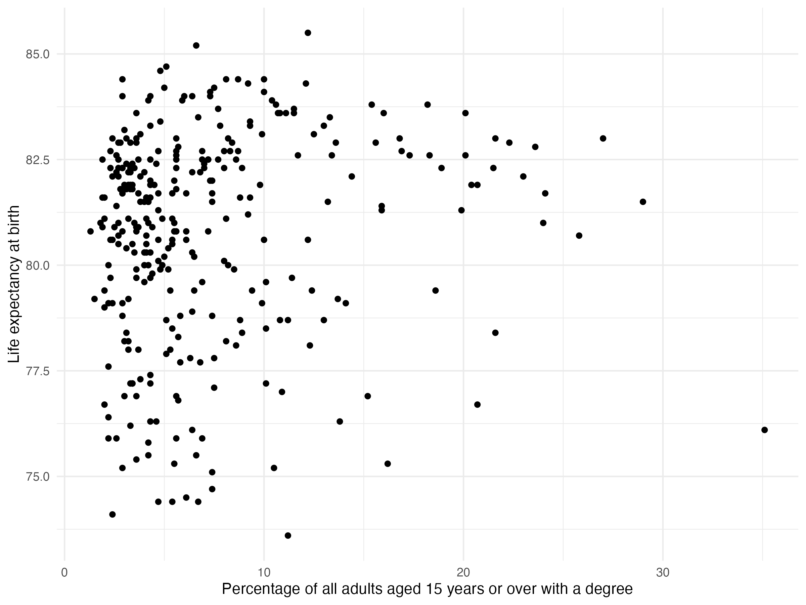
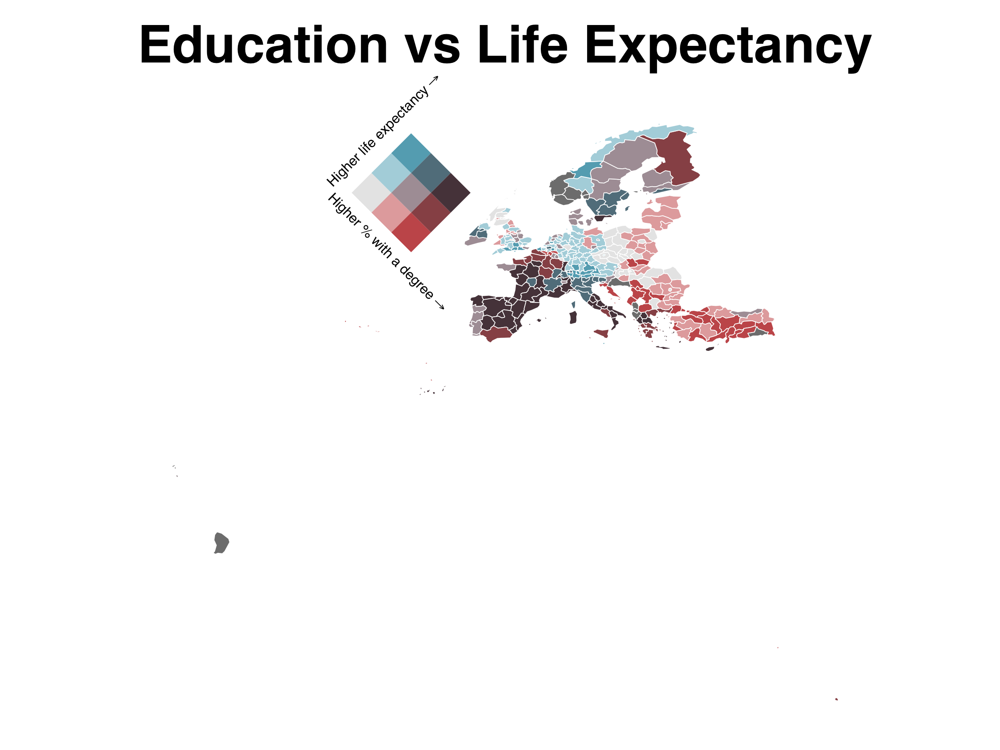

# mapineqr


<!-- README.md is generated from README.Rmd. Please edit that file -->

An R package to access the data from the <https://www.mapineq.org/> API
and dashboard (product of the [Mapineq](https://mapineq.eu/) proejct)

# mapineqr

<!-- badges: start -->

[](https://lifecycle.r-lib.org/articles/stages.html#experimental)
[](https://github.com/e-kotov/mapineqr/actions/workflows/R-CMD-check.yaml)
[](https://CRAN.R-project.org/package=mapineqr)
<!-- badges: end -->

The goal of `{mapineqr}` is to access the data from the [Mapineq.org
API](https://www.mapineq.org/data-users/) and
[dashboard](https://dashboard.mapineq.org/datacatalogue) (product of the
[Mapineq](https://mapineq.eu/) proejct).

## Installation

<!-- Install from CRAN:
&#10;```r
install.packages('mapineqr')
``` -->

Install latest release from **R-multiverse**:

``` r
install.packages('mapineqr',
 repos = c('https://e-kotov.r-universe.dev', 'https://cloud.r-project.org')
)
```

You can also install the development version of `mapineqr` from GitHub:

``` r
if (!require("pak")) install.packages("pak")
pak::pak("e-kotov/mapineqr")
```

``` r
# load packages used in the examples on this page
library(mapineqr)
library(dplyr)
library(ggplot2)
library(eurostat)
library(sf)
library(biscale)
```

## Basic Example - univariate data and maps

1.  Get the full list of available data at NUTS 3 level:

``` r
library(mapineqr)

available_data <- mi_sources(level = "3")
head(available_data)
```

    # A tibble: 52 × 3
       source_name    short_description      description                                                         
       <chr>          <chr>                  <chr>                                                               
     1 DEMO_R_D3AREA  "Area by NUTS 3 regio" Area by NUTS 3 region (ESTAT)                                       
     2 PROJ_19RAASFR3 "Assumptions for fert" Assumptions for fertility rates by age, type of projection and NUTS…
     3 PROJ_19RAASMR3 "Assumptions for prob" Assumptions for probability of dying by age, sex, type of projectio…
     4 BD_HGNACE2_R3  "Business demography " Business demography and high growth enterprise by NACE Rev. 2 and N…
     5 BD_SIZE_R3     "Business demography " Business demography by size class and NUTS 3 regions (ESTAT)        
     6 CENS_11DWOB_R3 "Conventional dwellin" Conventional dwellings by occupancy status, type of building and NU…
     7 CRIM_GEN_REG   "Crimes recorded by t" Crimes recorded by the police by NUTS 3 regions (ESTAT)             
     8 DEMO_R_MAGEC3  "Deaths by age group," Deaths by age group, sex and NUTS 3 region (ESTAT)                  
     9 DEMO_R_MWK3_T  "Deaths by week and N" Deaths by week and NUTS 3 region (ESTAT)                            
    10 DEMO_R_MWK3_TS "Deaths by week, sex " Deaths by week, sex and NUTS 3 region (ESTAT)                       
    # ℹ 42 more rows
    # ℹ Use `print(n = ...)` to see more rows

2.  Select data source by `source_name` column and check it’s year and
    NUTS level coverage:

``` r
mi_source_coverage("CRIM_GEN_REG")
```

    # A tibble: 10 × 5
       nuts_level year  source_name  short_description    description                                            
       <chr>      <chr> <chr>        <chr>                <chr>                                                  
     1 0          2008  CRIM_GEN_REG Crimes recorded by t Crimes recorded by the police by NUTS 3 regions (ESTAT)
     2 0          2009  CRIM_GEN_REG Crimes recorded by t Crimes recorded by the police by NUTS 3 regions (ESTAT)
     3 0          2010  CRIM_GEN_REG Crimes recorded by t Crimes recorded by the police by NUTS 3 regions (ESTAT)
     4 1          2008  CRIM_GEN_REG Crimes recorded by t Crimes recorded by the police by NUTS 3 regions (ESTAT)
     5 1          2009  CRIM_GEN_REG Crimes recorded by t Crimes recorded by the police by NUTS 3 regions (ESTAT)
     6 1          2010  CRIM_GEN_REG Crimes recorded by t Crimes recorded by the police by NUTS 3 regions (ESTAT)
     7 2          2008  CRIM_GEN_REG Crimes recorded by t Crimes recorded by the police by NUTS 3 regions (ESTAT)
     8 2          2009  CRIM_GEN_REG Crimes recorded by t Crimes recorded by the police by NUTS 3 regions (ESTAT)
     9 2          2010  CRIM_GEN_REG Crimes recorded by t Crimes recorded by the police by NUTS 3 regions (ESTAT)
    10 3          2008  CRIM_GEN_REG Crimes recorded by t Crimes recorded by the police by NUTS 3 regions (ESTAT)

3.  Check the available filters for the data source:

``` r
mi_source_filters("CRIM_GEN_REG", year = 2010, level = "2")
```

    # A tibble: 6 × 4
      field field_label                                                           label                                    value     
      <chr> <chr>                                                                 <chr>                                    <chr>     
    1 unit  Unit of measure                                                       Number                                   NR        
    2 freq  Time frequency                                                        Annual                                   A         
    3 iccs  International classification of crime for statistical purposes (ICCS) Intentional homicide                     ICCS0101  
    4 iccs  International classification of crime for statistical purposes (ICCS) Robbery                                  ICCS0401  
    5 iccs  International classification of crime for statistical purposes (ICCS) Burglary of private residential premises ICCS05012 
    6 iccs  International classification of crime for statistical purposes (ICCS) Theft of a motorized land vehicle        ICCS050211

4.  Choose the indicator to filter (let it be burglaries) to and get the
    data:

``` r
x <- mi_data(x_source = "CRIM_GEN_REG", year = 2010, level = "2", x_filters = list(iccs = "ICCS05012"))
head(x)
```

    # A tibble: 6 × 4
      best_year geo   geo_name             x
      <chr>     <chr> <chr>            <int>
    1 2008      AT11  Burgenland (A)     223
    2 2008      AT12  Niederösterreich  2557
    3 2008      AT13  Wien              9319
    4 2008      AT21  Kärnten            507
    5 2008      AT22  Steiermark        1163
    6 2008      AT31  Oberösterreich     988

5.  Map the indicator using NUTS2 polygons:

``` r
library(eurostat)
library(ggplot2)

# load NUTS2 level polygons
nuts2 <- eurostat::get_eurostat_geospatial(nuts_level = 2, year = "2010", crs = "4326")

# join data to NUTS2 polygons
nuts2_crime <- nuts2 |> 
  left_join(x, by = "geo")

# plot a map of burglaries
map_burglaries <- ggplot(nuts2_crime) +
  geom_sf(aes(fill = x)) +
  scale_fill_viridis_c() +
  labs(title = "Number of burglaries of private residential premises in 2010") +
  theme_minimal()

ggsave("man/figures/map_burglaries.png", map_burglaries, width = 8, height = 6, dpi = 200, create.dir = TRUE)
```


## Advanced Example - bivariate data and maps

1.  Select two indicators.

Let those be (1) unemployment rate:

``` r
mi_source_coverage("TGS00010") |> dplyr::arrange(desc(year))
```

    # A tibble: 12 × 5
       nuts_level year  source_name short_description    description                                
       <chr>      <chr> <chr>       <chr>                <chr>                                      
     1 2          2022  TGS00010    Unemployment rate by Unemployment rate by NUTS 2 regions (ESTAT)
     2 2          2021  TGS00010    Unemployment rate by Unemployment rate by NUTS 2 regions (ESTAT)
     3 2          2020  TGS00010    Unemployment rate by Unemployment rate by NUTS 2 regions (ESTAT)
     4 2          2019  TGS00010    Unemployment rate by Unemployment rate by NUTS 2 regions (ESTAT)
     5 2          2018  TGS00010    Unemployment rate by Unemployment rate by NUTS 2 regions (ESTAT)
     6 2          2017  TGS00010    Unemployment rate by Unemployment rate by NUTS 2 regions (ESTAT)
     7 2          2016  TGS00010    Unemployment rate by Unemployment rate by NUTS 2 regions (ESTAT)
     8 2          2015  TGS00010    Unemployment rate by Unemployment rate by NUTS 2 regions (ESTAT)
     9 2          2014  TGS00010    Unemployment rate by Unemployment rate by NUTS 2 regions (ESTAT)
    10 2          2013  TGS00010    Unemployment rate by Unemployment rate by NUTS 2 regions (ESTAT)
    11 2          2012  TGS00010    Unemployment rate by Unemployment rate by NUTS 2 regions (ESTAT)
    12 2          2011  TGS00010    Unemployment rate by Unemployment rate by NUTS 2 regions (ESTAT)

And (2) life expectancy:

``` r
mi_source_coverage("DEMO_R_MLIFEXP") |> dplyr::arrange(desc(year))
```

    # A tibble: 96 × 5
       nuts_level year  source_name    short_description    description                                          
       <chr>      <chr> <chr>          <chr>                <chr>                                                
     1 0          2021  DEMO_R_MLIFEXP Life expectancy by a Life expectancy by age, sex and NUTS 2 region (ESTAT)
     2 1          2021  DEMO_R_MLIFEXP Life expectancy by a Life expectancy by age, sex and NUTS 2 region (ESTAT)
     3 2          2021  DEMO_R_MLIFEXP Life expectancy by a Life expectancy by age, sex and NUTS 2 region (ESTAT)
     4 0          2020  DEMO_R_MLIFEXP Life expectancy by a Life expectancy by age, sex and NUTS 2 region (ESTAT)
     5 1          2020  DEMO_R_MLIFEXP Life expectancy by a Life expectancy by age, sex and NUTS 2 region (ESTAT)
     6 2          2020  DEMO_R_MLIFEXP Life expectancy by a Life expectancy by age, sex and NUTS 2 region (ESTAT)
     7 0          2019  DEMO_R_MLIFEXP Life expectancy by a Life expectancy by age, sex and NUTS 2 region (ESTAT)
     8 1          2019  DEMO_R_MLIFEXP Life expectancy by a Life expectancy by age, sex and NUTS 2 region (ESTAT)
     9 2          2019  DEMO_R_MLIFEXP Life expectancy by a Life expectancy by age, sex and NUTS 2 region (ESTAT)
    10 0          2018  DEMO_R_MLIFEXP Life expectancy by a Life expectancy by age, sex and NUTS 2 region (ESTAT)
    # ℹ 86 more rows
    # ℹ Use `print(n = ...)` to see more rows

2.  Check for available filters:

``` r
mi_source_filters("TGS00010", year = 2018, level = "2")
```

    # A tibble: 12 × 4
       field   field_label                                                     label                                                                      value 
       <chr>   <chr>                                                           <chr>                                                                      <chr> 
     1 unit    Unit of measure                                                 Percentage                                                                 PC    
     2 isced11 International Standard Classification of Education (ISCED 2011) All ISCED 2011 levels                                                      TOTAL 
     3 isced11 International Standard Classification of Education (ISCED 2011) Less than primary, primary and lower secondary education (levels 0-2)      ED0-2 
     4 isced11 International Standard Classification of Education (ISCED 2011) Upper secondary and post-secondary non-tertiary education (levels 3 and 4) ED3_4 
     5 isced11 International Standard Classification of Education (ISCED 2011) Tertiary education (levels 5-8)                                            ED5-8 
     6 isced11 International Standard Classification of Education (ISCED 2011) Unknown                                                                    UNK   
     7 isced11 International Standard Classification of Education (ISCED 2011) No response                                                                NRP   
     8 sex     Sex                                                             Total                                                                      T     
     9 sex     Sex                                                             Males                                                                      M     
    10 sex     Sex                                                             Females                                                                    F     
    11 freq    Time frequency                                                  Annual                                                                     A     
    12 age     Age class                                                       15 years or over                                                           Y_GE15

``` r
mi_source_filters("DEMO_R_MLIFEXP", year = 2018, level = "2") |> print(n=90)
```

    # A tibble: 91 × 4
       field field_label     label            value
       <chr> <chr>           <chr>            <chr>
     1 unit  Unit of measure Year             YR   
     2 sex   Sex             Total            T    
     3 sex   Sex             Males            M    
     4 sex   Sex             Females          F    
     5 freq  Time frequency  Annual           A    
     6 age   Age class       Less than 1 year Y_LT1
     7 age   Age class       1 year           Y1   
     8 age   Age class       2 years          Y2   
     9 age   Age class       3 years          Y3   
    10 age   Age class       4 years          Y4   
    11 age   Age class       5 years          Y5   
    12 age   Age class       6 years          Y6   
    13 age   Age class       7 years          Y7   
    14 age   Age class       8 years          Y8   
    15 age   Age class       9 years          Y9   
    16 age   Age class       10 years         Y10  
    17 age   Age class       11 years         Y11  
    ...

3.  Get the data for the two indicators:

``` r
xy_data <- mi_data(
  year = 2018,
  level = "2",
  x_source = "TGS00010", x_filters = list(isced11 = "TOTAL", unit = "PC", age = "Y_GE15", sex = "T", freq = "A"),
  y_source = "DEMO_R_MLIFEXP", y_filters = list(unit = "YR", age = "Y_LT1", sex = "T", freq = "A")
)
```

4.  Plot the scratterplot:

``` r
edu_v_life_exp_plot <- ggplot(xy_data, aes(x = x, y = y)) +
  geom_point() +
  labs(x = "Percentage of all adults aged 15 years or over with a degree", y = "Life expectancy at birth") +
  theme_minimal()
# ggsave("man/figures/edu_v_life_exp_plot.png", edu_v_life_exp_plot, width = 8, height = 6, units = "in", dpi = 300)
```



4.  Add the bivariate data to the NUTS2 polygons and create a plot:

``` r
nuts2 <- eurostat::get_eurostat_geospatial(nuts_level = 2, year = "2016", crs = "4326")
nuts2_edu_v_life_exp <- nuts2 |>
  left_join(xy_data, by = "geo")
```

``` r
library(biscale)
bidata <- bi_class(nuts2_edu_v_life_exp, x = x, y = y, style = "quantile", dim = 3)

legend <- bi_legend(pal = "GrPink",
                    dim = 3,
                    xlab = "              Higher % with a degree",
                    ylab = "              Higher life expectancy",
                    size = 8)
```

``` r
map <- ggplot() +
  geom_sf(data = bidata, mapping = aes(fill = bi_class), color = "white", size = 0.1, show.legend = FALSE) +
  bi_scale_fill(pal = "GrPink", dim = 3) +
  labs(
    title = "Education vs Life Expectancy"
  ) +
  bi_theme()

png("man/figures/edu_v_life_exp_map.png", width = 8, height = 6, units = "in", res = 300)
print(map)
print(legend, vp = grid::viewport(x = 0.4, y = .75, width = 0.2, height = 0.2, angle = -45))
dev.off()
```



## Citation

To cite the R package and data in publications use:

Kotov E (2024). *mapineqr. Access Mapineq inequality indicators via
API*. doi:10.32614/CRAN.package.mapineqr
<https://doi.org/10.32614/CRAN.package.mapineqr>,
<https://github.com/e-kotov/mapineqr>.

Mills M, Leasure D (2024). “Mapineq Link: Geospatial Dashboard and
Database.” doi:10.5281/zenodo.13864000
<https://doi.org/10.5281/zenodo.13864000>.

BibTeX:

    @Manual{mapineqr,
      title = {mapineqr. Access Mapineq inequality indicators via API},
      author = {Egor Kotov},
      year = {2024},
      url = {https://github.com/e-kotov/mapineqr},
      doi = {10.32614/CRAN.package.mapineqr},
    }

    @Misc{mapineq_link,
      title = {Mapineq Link: Geospatial Dashboard and Database},
      author = {Melinda C Mills and Douglas Leasure},
      year = {2024},
      month = {October},
      publisher = {Mapineq deliverables. Turku: INVEST Research Flagship Centre / University of Turku},
      doi = {10.5281/zenodo.13864000},
    }
